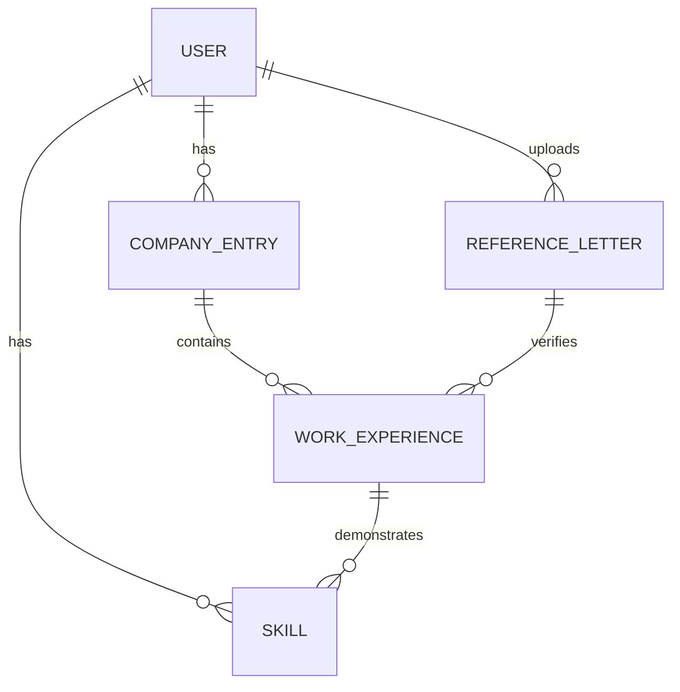

# Data Model: Profile Generation from References

## Entity Relationship Diagram (Conceptual)

## Schema Definitions

### UserProfile (users table)
*Existing or new table*
- `id`: UUID (PK)
- `email`: String (Unique)
- `full_name`: String
- `created_at`: Timestamp

### ReferenceLetter (reference_letters table)
- `id`: UUID (PK)
- `user_id`: UUID (FK -> users.id)
- `filename`: String
- `storage_path`: String
- `content_hash`: String (for deduplication)
- `upload_date`: Timestamp
- `extraction_status`: Enum (PENDING, COMPLETED, FAILED)
- `extracted_metadata`: JSONB (Raw extracted data backup)

### CompanyEntry (companies table)
*Aggregates work experience at a specific organization*
- `id`: UUID (PK)
- `user_id`: UUID (FK -> users.id)
- `name`: String (e.g., "Google")
- `logo_url`: String (optional)
- `start_date`: Date (earliest from roles)
- `end_date`: Date (latest from roles, or NULL if current)

### WorkExperience (work_experiences table)
- `id`: UUID (PK)
- `company_id`: UUID (FK -> companies.id)
- `title`: String (e.g., "Senior Software Engineer")
- `start_date`: Date
- `end_date`: Date (NULL = Present)
- `description`: Text
- `source`: Enum (VERIFIED, SELF_REPORTED)
- `employer_feedback`: Text (Extracted quotes/sentiment)
- `reference_letter_id`: UUID (FK -> reference_letters.id, nullable)
- `is_verified`: Boolean

### Skill (skills table)
- `id`: UUID (PK)
- `name`: String (Normalized, e.g., "Go", "React")

### ExperienceSkill (experience_skills junction)
- `work_experience_id`: UUID (FK)
- `skill_id`: UUID (FK)

